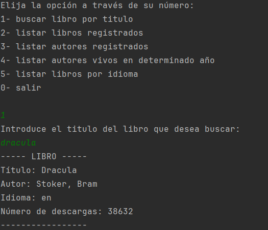
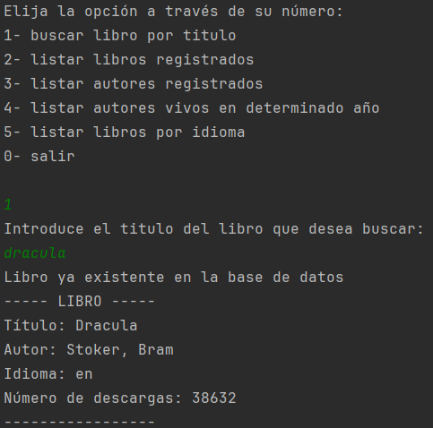
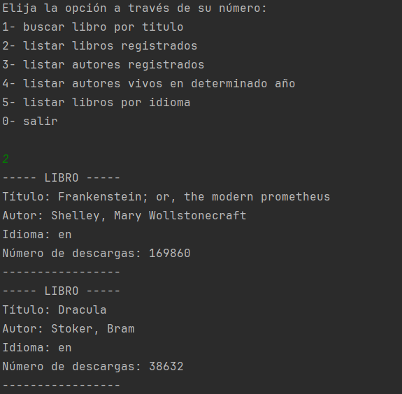
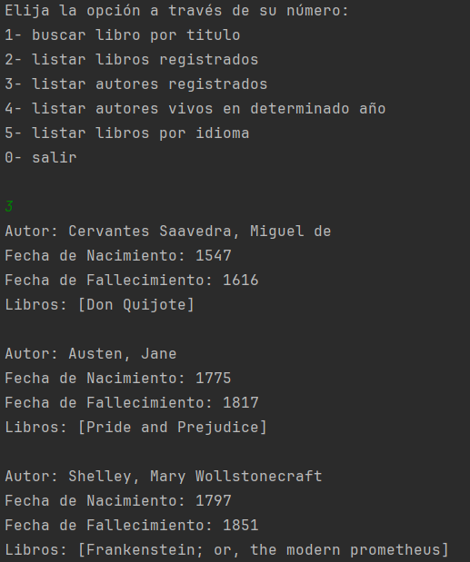
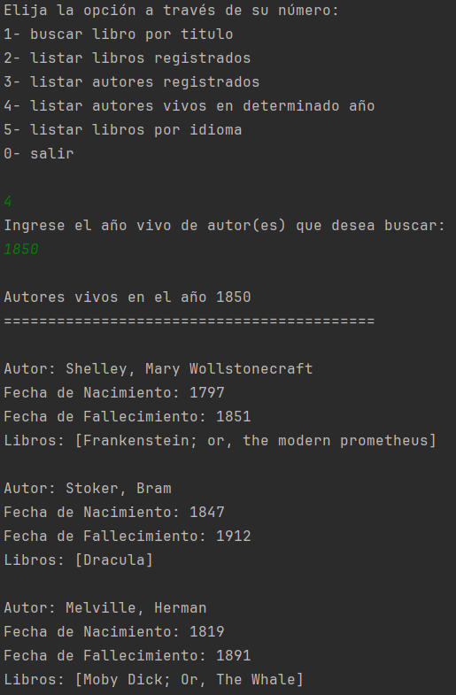
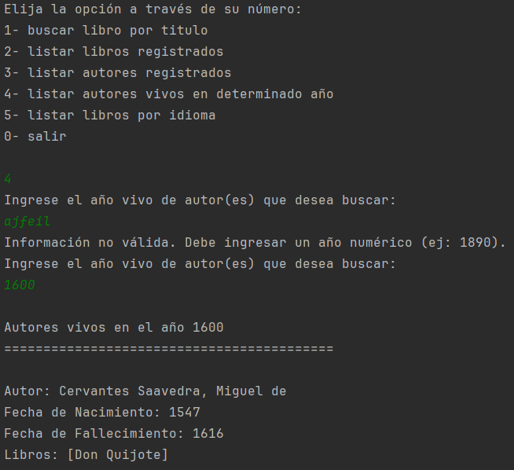
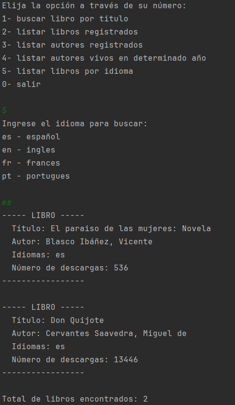
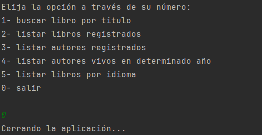

# challenge-literalura


Aplicación de consola desarrollada en Java con Spring Boot que permite gestionar un catálogo de libros y autores, integrando la API de Gutendex y base de datos PostgreSQL.

---

##  Vista del Programa


###  Ejemplo de busqueda de libro por titulo


###  Ejemplo de busqueda de libro por titulo ya en la base de datos


###  Ejemplo Listar libros registrados


###  Ejemplo listar autores registrados


###  Ejemplo listar autores vivos en determinado año


###  Ejemplo error listar autores vivos en determinado año


###  Ejemplo listar libros por idioma


###  Ejemplo opcion salir



---


##  Características

-  Buscar libro por título (API Gutendex)
-  Listar todos los libros registrados
-  Listar autores con sus libros
-  Listar autores vivos en un año específico
-  Listar libros por idioma (es, en, fr, pt)

---

##  Tecnologías utilizadas

- Java 17+
- Spring Boot 3
- Spring Data JPA
- PostgreSQL
- Maven
- Gutendex API

---

##  Cómo ejecutar el proyecto

```bash
git clone https://github.com/jcesarcorrea/challenge-literalura.git
cd challenge-literalura
```
##  Requisitos Previos
-  Java JDK 17 o superior
-  PostgreSQL 15 o superior
-  Maven 3.8 o superior

##  Configuración de la Base de Datos
```sql
CREATE DATABASE literalura;
```

##  Configuración de application.properties
-  spring.datasource.url=jdbc:postgresql://localhost:5432/literalura
-  spring.datasource.username=TU_USUARIO
-  spring.datasource.password=TU_CONTRASEÑA
-  spring.jpa.hibernate.ddl-auto=update
